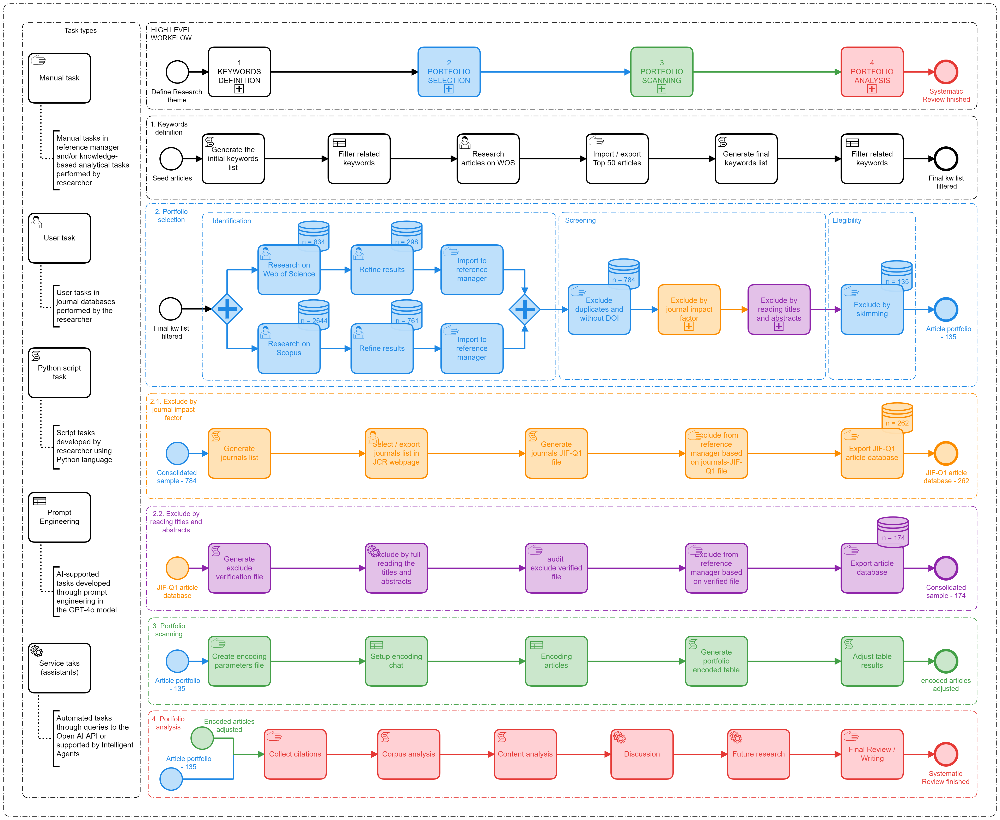

	 

# A.I. Co-piloted Sistematic Literature Review
## Project Description
This repository contains all the source code and data for the article *"Emerging & data technologies applied to public sector: an AI-copiloted systematic literature review"*, written by Maurício Vasconcellos Leão Lyrio, Fabrícia Silva da Rosa, Miklos A. Vasarhelyi and Rogério João Lunkes.

## Methodology

The authors propose a systematic process for literature review, co-piloted by artificial intelligence (H. Gu et al., 2024) and inspired by previous studies (Lyrio et al., 2018; Page et al., 2021; Ruijer et al., 2023; Short, 2009; Straub et al., 2023), which seeks to establish an organized flow of activities to generate knowledge on a given topic.

The approach consists of 4 phases that aim to identify a portfolio of studies related to the topic and then classify and analyze them in order to identify the research profile and opportunities for future studies. The figure below presents the workflow and types of tasks involved, providing a clear guide regarding the tasks and responsibilities of each phase of the process.

The tasks are defined according to the research needs and tools used, as follows:

(i) manual task – tasks performed in a reference manager and/or knowledge-based analytical tasks performed by researchers;

(ii) user task – tasks performed by researchers in journal databases;

(iii) script task – tasks automated through python scripts, used to process data or perform searches;

(iv) prompt task – tasks in which query instructions (prompts) are used to interact with AI models;

(v) assistant task – tasks delegated to AI assistants to perform specific tasks, such as filtering or categorizing articles.

## Installation and use
To use the repository, you must create a virtual environment `python -m venv venv`. Then you must initialize the virtual environment `venv/scripts/activate -> command for windows` and install the dependencies `pip install -r requirements.txt`.

To run the application locally, type the Streamlit initialization command `streamlit run 1_??_home.py`.

You must add credits to your [OpenAI Platform](https://platform.openai.com/docs/overview) account in order to run the assistant. In the settings tab, click on organization > Billing and enter the desired value.

To initialize the Assistant, you must enter the OpenAI API key. To do so, go to [OpenAI Platform](https://platform.openai.com/docs/overview) > Dashboard > API Keys and create a new API key. After creating the key, copy and paste it into the location indicated in the .env file

## Citation
Waiting article publication.

## Contact
Corresponding author: [Maurício Vasconcellos Leão Lyrio](https://br.linkedin.com/in/maurício-vasconcellos-leão-lyrio-59773220)

## Acknowledgements
The authors thank the National Council for Scientific and Technological Development – ​​CNPq (Process: 201489/2024-4) for financial support for the research.
